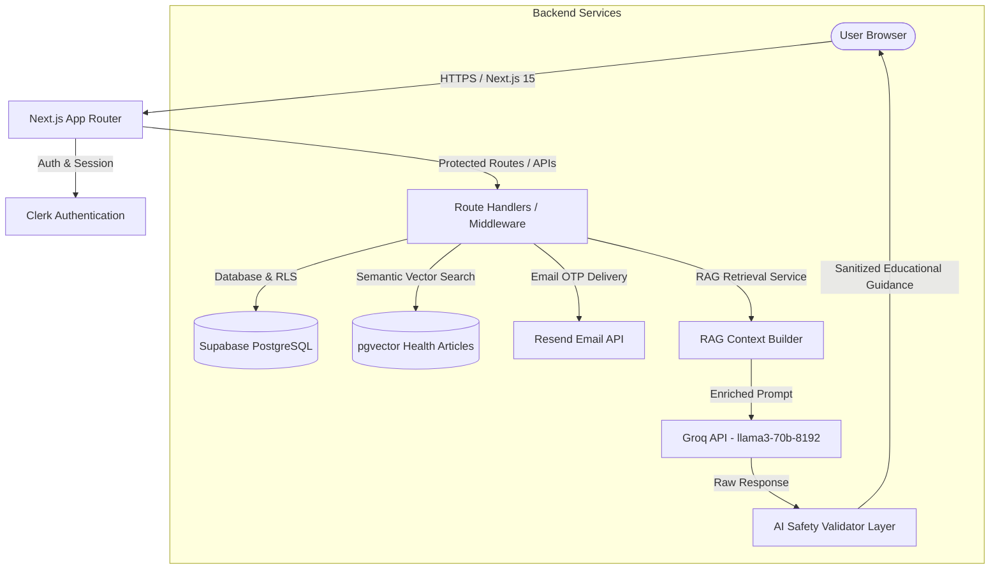

# 🌸 CareSphere — AI-Powered Women's Health & UTI Education Platform

<div align="center">


**A full-stack, responsive digital health platform providing personalized women's wellness awareness and boys' UTI education — powered by RAG, Groq AI, and empathetic design.**

[Features](#-key-features) • [Architecture](#-architecture) • [Workflow](#-dual-experience-workflow) • [Getting Started](#-getting-started) • [API & Diagnostics](#-testing--diagnostics) • [Safety Disclaimer](#-ai-safety--clinical-boundaries)

</div>

---

## 🌟 Overview

**CareSphere** bridges critical knowledge gaps in reproductive, hormonal, and urinary health through an intuitive dual-experience web platform:

1. 👩 **Women's Health Experience**: Comprehensive menstrual cycle tracking, PCOS/PCOD awareness, UTI prevention, phase-aligned nutrition, hydration scheduling, and consent-based partner sharing.
2. 👨 **Boys' UTI Education Experience**: Stigma-free, dedicated educational guides covering male urinary tract anatomy, symptom awareness, hygiene habits, myth-busting, and emergency red flags.

### 🏛️ The Four Core Product Pillars
The entire platform is built around four interconnected product pillars:
$$\text{Symptoms} \longrightarrow \text{Prevention} \longrightarrow \text{Education} \longrightarrow \text{Remedies}$$

---

## ✨ Key Features

### 👩 Women's Experience
* **🩸 4-Phase Cycle Tracking**: Visual calendar, flow/cramps/mood loggers, phase prediction (*Menstrual, Follicular, Ovulatory, Luteal*), and phase-specific lifestyle & dietary tips.
* **🩺 Multi-Category Symptom Logger**: Severity chips (Mild/Moderate/Severe), duration, notes, real-time log history, and automatic links to related study resources.
* **🧬 PCOS / PCOD Education Hub**: Evidence-informed breakdowns of hormonal pathways, insulin sensitivity, and holistic lifestyle management without alarmism.
* **🚽 UTI Awareness & Red Flags**: Female urinary anatomy guides, preventative hygiene, hydration habits, and emergency escalation alerts.
* **🥗 Cycle-Aware Nutrition**: 5-meal daily logger (*Breakfast, Morning Snack, Lunch, Evening Snack, Dinner*) paired with hormone-supporting nutrient suggestions.
* **💧 Smart Hydration & Food Reminders**: SVG daily progress ring, quick-add buttons (150ml–500ml), configurable reminder schedules (no forced targets), and Web Push / Service Worker notifications.
* **📊 Insights Engine & Doctor's Health Summary**: Deterministic rules-based trend analysis, weekly highlights, and one-click printable **Doctor's Health Summary PDF report** for medical visits.
* **💗 Loved Ones System & OTP Security**: Granular consent controls (*Cycle Status, Period Dates, UTI Info, PCOS/PCOD Info, Private Notes*), bcrypt-salted 6-digit OTP verification, and instant revocation.

### 👨 Boys' Experience
* **📚 Dedicated Male UTI Education**: Comprehensive modules covering anatomy differences, risk factors, myths vs. facts, and preventative habits.
* **🩺 Male Symptom Checker**: Checks for burning, frequency, and difficulty starting urination with immediate red-flag warnings for fever, flank pain, or hematuria.
* **🌿 Safe Self-Care Guidance**: Non-prescription comfort measures and explicit warnings against self-medicating with leftover antibiotics.
* **💗 Partner View**: Request access to partner's permitted health cards with single-use OTP verification and strict read-only authorization.

### 🧠 AI & Study Resources Engine
* **🔍 RAG Semantic Retrieval**: Powered by Supabase `pgvector` (`match_articles`) over curated clinical guidelines (AUA, ACOG, Endocrine Society, CDC, WHO) with keyword fallback.
* **🤖 Groq `llama3-70b-8192` Assistant**: Context-isolated AI chatbot providing empathetic educational answers without prescribing medications or claiming definitive diagnoses.
* **🛡️ AI Safety Validator**: Strict multi-layer validation that intercepts antibiotic names (*Amoxicillin, Nitrofurantoin, Ciprofloxacin*), blocks diagnostic claims, and injects emergency escalation guidance when red-flag symptoms are detected.
* **📖 Interactive Study Resource Center**: Filter by categories, search clinical study guides, read in a focused modal reader, and click **"Ask AI Assistant About This"** for contextual chat.

---

## 🏗️ Architecture



---

## 🎨 Design System — "Empathetic Precision"

Designed with **Google Stitch** principles, featuring a dual-palette visual system:

| Experience | Primary Palette | Accent / Neutral | Vibe |
|---|---|---|---|
| **👩 Women** | Lavender (`#c026d3`), Muted Rose (`#fda4af`), Dusty Peach (`#fdb274`) | Slate (`#334155`), Warm White (`#fafaf9`) | Calm, trustworthy, feminine, refined |
| **👨 Boys** | Navy (`#0f172a`), Ocean Teal (`#0d9488`), Sky (`#38bdf8`) | Slate (`#475569`), Cool White (`#f8fafc`) | Modern, clean, educational, approachable |

---

## 🗺️ Complete Sitemap

```text
PUBLIC
├── /                           # Landing Page with dual CTAs & feature demos
├── /sign-in                    # Clerk Google & Email Sign-In
└── /sign-up                    # Clerk Account Registration

ONBOARDING
└── /onboarding                 # 6-Step Personal Health Profile Wizard

👩 WOMEN'S DASHBOARD (/woman)
├── /woman                      # Main Dashboard (Cycle Banner, Glance Stats, Quick Actions)
├── /woman/symptoms             # Multi-Category Symptom Logger & Related Studies
├── /woman/prevention           # Preventative Habits & Wellness Guidelines
├── /woman/education            # Health Education & Study Resource Center
├── /woman/remedies             # Safe Non-Prescription Self-Care & Red Flags
├── /woman/cycle                # Period Tracker, Phase Prediction & Calendar
├── /woman/pcos-pcod            # PCOS / PCOD Educational Breakdown & Support
├── /woman/uti                  # Female UTI Symptom Awareness & Hydration Habits
├── /woman/nutrition            # 5-Meal Schedule & Phase-Aware Nutrition
├── /woman/food-reminder        # Configurable Meal Reminders & Notifications
├── /woman/water-reminder       # Hydration Progress Ring & Reminder Intervals
├── /woman/loved-ones           # Partner Sharing, Permissions & OTP Access
├── /woman/insights             # Weekly/Monthly Trends & Doctor's Health Summary Export
├── /woman/ai-assistant         # RAG-Enriched AI Health Education Assistant
└── /woman/profile              # User Preferences, Privacy & Account Settings

👨 BOYS' DASHBOARD (/man)
├── /man                        # Male UTI Education Dashboard
├── /man/education              # In-Depth Male UTI Study Guides & Myths
├── /man/symptoms               # Male UTI Symptom Checker & Red-Flag Alerts
├── /man/prevention             # Daily Hygiene & Preventative Hydration
├── /man/self-care              # Safe Self-Care & Anti-Self-Medication Advice
├── /man/loved-ones             # Request Partner Access & OTP Verification
├── /man/ai-assistant           # RAG-Enriched Male UTI AI Assistant
└── /man/profile                # Profile & Privacy Settings

API ROUTES (/api)
├── /api/ai/chat                # Groq + RAG Semantic Injection + Safety Validator
├── /api/articles               # Personalized Study Recommendations & Categories
├── /api/articles/[id]          # Single Article Reader & Related Studies
├── /api/cycle                  # Cycle Logging & History
├── /api/insights               # Rules-Based Health Trend Generator
├── /api/onboarding/complete    # Profile Setup Handler
├── /api/partner/otp/generate   # Bcrypt 6-Digit OTP Generator & Resend Email
├── /api/partner/otp/verify     # Single-Use OTP Verification & Consent
├── /api/partner/permissions    # Granular Category-Level Permission Manager
├── /api/partner/shared-data    # Authorized Shared Health Viewer
├── /api/symptoms               # Symptom History & Logging
└── /api/water                  # Daily Hydration Logger & Progress
```

---

## 🚀 Getting Started

### 1. Prerequisites
* **Node.js**: `v18.18.0` or higher (Node.js 20+ recommended)
* **npm**: `v9.0.0` or higher
* **Supabase Account** (free tier with PostgreSQL & pgvector)
* **Clerk Account** (free tier for authentication)
* **Groq Cloud Account** (free tier API key)
* **Resend Account** (optional for email OTP delivery)

---

### 2. Installation

Clone the repository and install dependencies:
```bash
git clone https://github.com/your-username/caresphere-health-platform.git
cd caresphere-health-platform
npm install --legacy-peer-deps
```

---

### 3. Environment Variables Configuration

Create a `.env.local` file in the root directory:
```env
# Clerk Authentication
NEXT_PUBLIC_CLERK_PUBLISHABLE_KEY=pk_test_...
CLERK_SECRET_KEY=sk_test_...
NEXT_PUBLIC_CLERK_SIGN_IN_URL=/sign-in
NEXT_PUBLIC_CLERK_SIGN_UP_URL=/sign-up
NEXT_PUBLIC_CLERK_SIGN_IN_FALLBACK_REDIRECT_URL=/onboarding
NEXT_PUBLIC_CLERK_SIGN_UP_FALLBACK_REDIRECT_URL=/onboarding
NEXT_PUBLIC_CLERK_SIGN_IN_FORCE_REDIRECT_URL=/onboarding
NEXT_PUBLIC_CLERK_SIGN_UP_FORCE_REDIRECT_URL=/onboarding

# Supabase (PostgreSQL + RLS + pgvector)
NEXT_PUBLIC_SUPABASE_URL=https://your-project.supabase.co
NEXT_PUBLIC_SUPABASE_ANON_KEY=eyJhbGciOiJIUzI1NiIsInR5cCI6IkpXVCJ9...
SUPABASE_SERVICE_ROLE_KEY=eyJhbGciOiJIUzI1NiIsInR5cCI6IkpXVCJ9...

# Groq Cloud AI (llama3-70b-8192)
GROQ_API_KEY=gsk_your_groq_api_key_here

# App Security & Secrets
NEXT_PUBLIC_APP_URL=http://localhost:3000
APP_SECRET=your_random_64_char_secret_here
OTP_EXPIRY_MINUTES=10
OTP_MAX_ATTEMPTS=3
OTP_RATE_LIMIT_WINDOW_MINUTES=60
OTP_RATE_LIMIT_MAX=3
```

---

### 4. Database Setup (Supabase)

1. Open your **Supabase Dashboard** → **SQL Editor**.
2. Run [`supabase/migrations/001_initial_schema.sql`](supabase/migrations/001_initial_schema.sql) (Creates all core tables, RLS policies, indexes, and triggers).
3. Run [`supabase/migrations/002_rag_and_articles.sql`](supabase/migrations/002_rag_and_articles.sql) (Enables `pgvector`, creates `health_articles`, the `match_articles()` similarity search RPC, and seeds clinical knowledge).

*(Note: The application includes in-memory clinical fallbacks so all endpoints and RAG queries work out-of-the-box even before running SQL migrations).*

---

### 5. Running the Application Locally

```bash
npm run dev
```

Open **[http://localhost:3000](http://localhost:3000)** in your browser.

---

## 🧪 Testing & Diagnostics

CareSphere includes a standalone backend and route verification suite:

```bash
# 1. Full TypeScript Type Check
npx tsc --noEmit

# 2. Run Backend Logic & Safety Test Suite (15 Automated Unit Tests)
node --env-file=.env.local --import tsx scripts/diagnose_backend.ts

# 3. Run Live HTTP Route Audit (Tests all 27 pages and APIs)
node --import tsx scripts/diagnose_routes.ts
```

---

## 🛡️ AI Safety & Clinical Boundaries

> [!IMPORTANT]
> **CareSphere is designed exclusively for health education, symptom awareness, and wellness support.**
> 
> * **No Prescriptions**: CareSphere strictly prohibits recommending antibiotic regimens or pharmaceutical prescriptions.
> * **No Definite Diagnosis**: Symptoms and cycle trends are presented for self-awareness and informed clinician discussions, not medical diagnostic conclusions.
> * **Automatic Emergency Escalation**: Queries or symptom logs featuring red flags (high fever, flank pain, visible blood in urine, or severe pelvic pain) immediately trigger clinical escalation alerts directing the user to urgent professional medical care.

---

## 🔒 Security & Privacy

* **Zero Full-Database LLM Exposure**: Only relevant RAG clinical knowledge excerpts and authorized user signals are sent to Groq.
* **Granular Partner Access**: Female users explicitly toggle which categories their partner can view (*Cycle, UTI, PCOS, Notes*).
* **Cryptographic OTP Safeguards**: 6-digit partner connection codes are hashed with bcrypt (salt rounds = 10) with a 10-minute expiry and rate-limiting to prevent brute force.
* **Strict Row-Level Security (RLS)**: Users can only query their own records or records explicitly permitted through authorized partner links.

---

## 📄 License

This project is licensed under the **MIT License** — see the [LICENSE](LICENSE) file for details.

<div align="center">
  <sub>Built with care for health education & wellness awareness.</sub>
</div>
